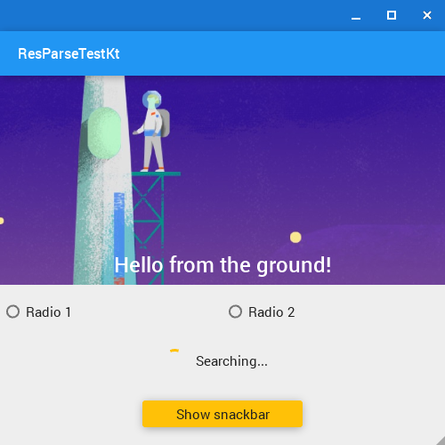
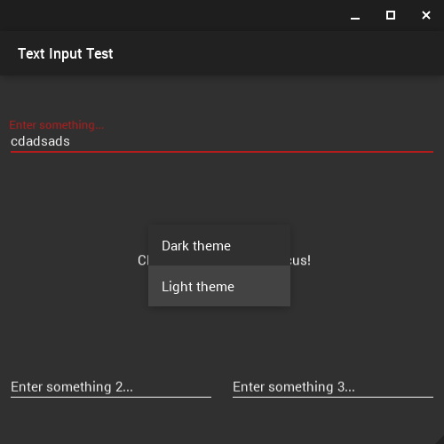
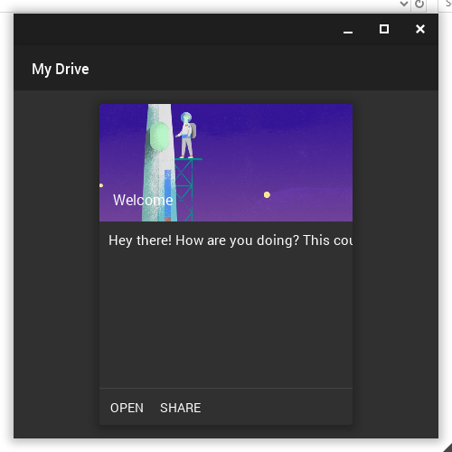

# Material Design Library + Extensible Views for Java and Kotlin

### Table of Contents
  - [What is this](#what)
  - [Screenshots](#screenshots)
  - [What is this](#what)
  - [Components](#components)
    - [Views](#views)
    - [Buttons](#buttons)
    - [Text fields](#text-fields)
    - [Progress bars](#progress-bars)
    - [Checkboxes](#checkboxes)
    - [Radiobuttons](#radiobuttons)
    - [Drawers](#drawers)
    - [Snackbars](#snackbar)
  - [Context Menus](#context-menus)
  - [Layouts](#layouts)
    - [View groups](#view-groups)
    - [Relative layout](#relative-layout)
    - [Linear layout](#linear-layout)
    - [Custom frame decoration](#custom-frame-direction)
    - [Drawer layout](#drawer-layout)
    - [Elevated layout](#elevated-layout)
    - [Layout params](#layout-params)
      - [Float params](#float-params)
      - [XML params](#xml-params)
    - [List layout](#list-layout)
    - [Overlay layouts](#overlay-layouts)
    - [Scroll layout](#scroll-layout)
  - [Renderers](#renderers)
  - [XML Layouts](#xml-layouts)
    - [Transpiling](#transpiling)
    - [XML Layout Inflator](#layout-inflator)
    - [XML Resource Parser](#res-parser)
  - [Themeing](#themeing)
    - [Light](#light)
    - [Dark](#dark)
    - [Custom](#custom)
  - [Animations](#animations)
    - [Choreographer](#choregrapher)
    - [Interpolators](#interpolators)
  - [Drawables](#drawables)
    - [Standard drawables](#standard-drawables)
    - [Stateful drawables](#stateful-drawables)
    - [Animated drawables](#animated-drawables)
  - [Concurrency](#concurrency)
    - [Loopables](#loopables)
    - [Loopers](#loopers)
    - [Messages](#messages)

*Note: currently, not all sections are documented. I'm working on this.*

---

### What is this?
This is a Android-like View based system for Java, written in Kotlin, with Material Design Views. This makes it easy to implement material UI on desktop with Kotlin/Java. You can write layouts in XML or Kotlin, compile and theme them within seconds and get your UI off the ground.

### Screenshots
Check these out:

 
*A basic implementation using radio buttons, image drawables, buttons, and snackbars*
 

 
*An example of using a dark theme, with a visible context menu*
 

 
*An example of using a card with multiple button actions, centered in a frame with no wrap enabled*
 
 
More screenshots/examples available under `git-assets/`

---

### Components
There are tons of components built into the standard library, with the option to easily create your custom views as required.

#### Views
The basis for all other components, and have a number of properties including states, min and max sizes, visibility, backgrounds, translations, context menu, etc. All other views must implement this base view. Custom views may define other attributes, programmatically or through XML for XML layout compatibility. See `src/com.asdev/libjam/md/view/View.kt` for a full list of properties.
#### Buttons
A standard button element. Has two built-in themes: `flat` and `raised`. Have two additional parameters: `text`, the text to display in this button, and `type`, referencing the theme/type of this button (Either `BUTTON_TYPE_RAISED` or `BUTTON_TYPE_FLAT`).

Usage: `val button = Button(text = "button text", type = BUTTON_TYPE_RAISED)`

See: `src/com/asdev/libjam/md/view/ButtonView.kt`
#### Text Field/Input
A standard text input element. Has a number of customizable properties, including text color, text font, input max length, etc. By default, has one construction parameter: `label`, the input hint to display.

Usage: `val input = TextInputField(label = "Default hint text")`

See: `src/com/asdev/libjam/md/view/ButtonView.kt`
#### Progress bars/views
Currently, there are two progress views available: circular progress views (showing indefinite progress), and progress bars (showing definite and indefinite progress). Both can be customized in terms of color, animation speed, etc.

Usage: 

`val progress_circle = CircularProgressView() // no paramters by default, use method accessors`
`val progress_bar = ProgressView() // no parameters by default`

See: `src/com/asdev/libjam/md/view/CircularProgressView.kt`, `src/com/asdev/libjam/md/view/ProgressView.kt`
#### Checkboxes

#### Radiobuttons

#### Drawers

#### Snackbars

### Layouts

#### RelativeLayout

#### LinearLayout

#### Custom frame decoration

### Renderers

### XML Layout Inflation